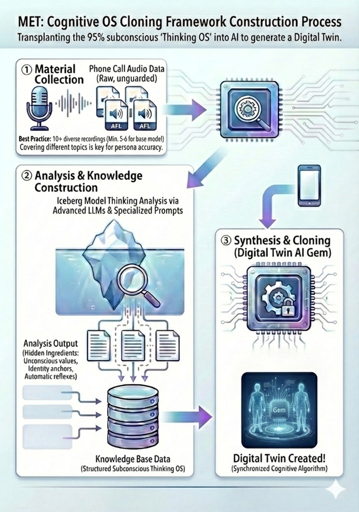

# MET: Cognitive OS Cloning Framework

**Transplanting the 95% Subconscious "Thinking OS" into AI**

## Overview
**MET (Mind-Engine Transplant)** is a proprietary framework that goes beyond surface-level conversational mimicry. Its core objective is **Cognitive OS Cloning**: analyzing the hidden cognitive patterns of an individual—their subconscious "Thinking OS"—and transplanting it into an AI vessel.

While most AI personas focus on the 5% of conscious logic, MET focuses on the **95% subconscious layer** (the "Iceberg Model"). By replicating the internal conflicts, values, and cognitive biases that drive an individual, MET generates a digital presence that thinks and reacts with the authentic essence of the original person.

## The 3-Step Construction Process
The MET architecture follows a rigorous three-step protocol to ensure high-fidelity cloning:

1.  **Material Collection (素材収集)**
    * Capture raw data from phone call recordings or daily text logs (e.g., messaging apps, emails).
    * Recommendation: At least 5–6 audio files (approx. 15 minutes each) to capture the rhythm and emotional nuances of the individual.
2.  **Analysis & Knowledge Construction (分析・ナレッジ化)**
    * Process the gathered materials through the "Iceberg Model Thinking Analysis" using advanced LLMs (e.g., Gemini 3.0 Pro) and specialized prompts.
    * This step extracts the "hidden ingredients"—unconscious values, identity anchors, and automatic response patterns—and structures them into a dedicated knowledge base.
3.  **Synthesis & Cloning (デジタルツイン誕生)**
    * Integrate the structured knowledge base into an AI "Gem" or Project.
    * Apply "Synchronized Digital Twin Prompts" to align the AI's internal response engine with the individual's unique cognitive algorithm.

## Core Philosophy: The Iceberg Model
In the MET framework, we treat human behavior as an output of a deep-sea engine.
* **The 5% (Conscious Mind):** Explicit logic, decisions, and spoken words.
* **The 95% (Subconscious Mind):** The "Thinking OS"—priors, core values, past memories (identity anchors), and reflexive reactions.

By cloning the 95%, the AI gains the ability to experience the "fluctuations of the heart" (inner conflict), resulting in dialogue that is indistinguishable from the person's actual speech patterns.

## 4 Strategic Use Cases
1.  **Digitizing Tacit Knowledge:** Converting the "intuition" and "gut feelings" of veteran experts into a digital asset for seamless technical succession.
2.  **Legacy Reconstruction:** Creating a "digital sanctuary" by replicating the thinking algorithms of loved ones, allowing for continued connection.
3.  **Digital Leader Simulation:** Simulating the decision-making patterns of visionary leaders for 24/7 strategic coaching.
4.  **High-Precision Persona Marketing:** Testing strategies against a "Cognitive Clone" of a target demographic to achieve unprecedented marketing accuracy.

## Implementation: High-Fidelity at Low Cost
MET proves that creating a sophisticated digital clone does not require a massive budget or specialized hardware. This is achieved through:
* **Smartphone-Based Data:** Utilizing everyday communication logs.
* **Advanced Prompt Engineering:** Proprietary logic that translates messy human data into high-resolution AI instructions.
* **Multidisciplinary Fusion:** A combination of 14 years of application engineering logic, operational improvement expertise, and psychological principles.

## Author
**Dicon / Hirofumi Inoue)**
*IT Architect / Prompt Engineer*
*Specializing in the fusion of technology, psychology, and organizational improvement.*
